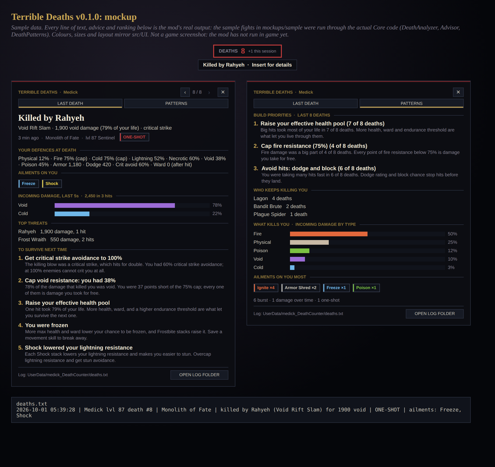

# MedicK's Terrible Deaths

*a death counter that tells you why.* A [MelonLoader](https://melonwiki.xyz) mod for **Last Epoch**: an always-on death counter, a permanent log of every death, and a Last Death panel that tells you who killed you, with what, and what to build so it does not happen again.

> Internal name `medick_DeathCounter` · **v0.1.0, not yet tested in game** (see [CURRENT-WORK.md](./CURRENT-WORK.md))

## What you get

**The counter.** A small `DEATHS 12` pill at the top of the screen, per character. It flashes red after a death and shows `Killed by Lagon · Insert for details` for a few seconds.

**The Last Death panel.** Press **Insert** (or click the counter):

- **Killed by** who, with which ability, for how much and which damage type, and whether it was a crit
- **How you died:** ONE-SHOT, BURST, DAMAGE OVER TIME, or WORN DOWN
- **Ailments on you:** Ignite, Bleed, Poison, Freeze, Shock, Armor Shred ...
- **Damage taken in the last 5 seconds** by damage type, and the **top threats**
- **To survive next time:** up to five suggestions picked from what actually killed you (cap fire resistance, stack armor, get critical strike avoidance to 100%, out-heal damage over time, stun avoidance ...)
- **‹ ›** to walk back through every earlier death of this character

**The Patterns tab.** Across this character's last 20 deaths:

- **Build priorities:** the three defences that would have helped the most deaths, each with its count ("Cap fire resistance (75%): 4 of 8 deaths"). A specific defence (a resistance, armor, crit avoidance, an ailment counter) leads over generic advice unless the generic one is clearly more common.
- Who keeps killing you, incoming damage by type (each death weighted equally), the ailments on you most, and the mix of death kinds.



*Mockup from the mod's real Core output (`mockups/build.py`), not a game screenshot.*

**The log.** Every death, forever, in `UserData/medick_DeathCounter/`:

| File | What |
|---|---|
| `deaths.txt` | One readable line per death |
| `deaths.jsonl` | Full detail, one JSON record per line (source of truth) |

The panel has an **OPEN LOG FOLDER** button.

## Controls

| Input | Does |
|---|---|
| `Insert` | Open / close the Last Death panel |
| `Shift + Insert` | Show / hide the counter |
| Click the counter | Open / close the panel |
| Shift-drag the counter | Move it |

## Settings

`UserData/medick_DeathCounter.cfg`:

| Entry | Default | |
|---|---|---|
| `Tracking` | `true` | Master switch: off = nothing is counted or logged |
| `ShowCounter` | `true` | The counter pill (Shift + PanelKey toggles it) |
| `ShowDeathToast` | `true` | "Killed by" line after a death |
| `PanelKey` | `Insert` | Any Unity KeyCode name |
| `HudX` / `HudY` | `0.5` / `0.015` | Counter position as a screen fraction |
| `HudScale` | `1.0` | Counter and panel size |
| `ProbeApi` | `false` | Dump the game's health/death/ailment API to the log at startup |
| `HookOverrides` | | Extra hooks, e.g. `hit:Il2Cpp.BaseHealth.ReceiveDamage; death:Il2Cpp.PlayerHealth.Die` |
| `DebugLog` | `false` | Verbose log |

## How it works

- **Death detection** uses three independent signals, and a latch makes sure each death counts once:
  1. **Hooks** on the player's `Dying.die`, `ActorSync.receiveDeath` and `ActorVisuals.Die`, plus a hit that takes health to 0. The death screen opening (`DeathScreen.toggle`) and `AnalyticsManager.PlayerDeath` also count, but only while the player's health reads 0 or below.
  2. **A health watch:** health crossing from above 0 to 0.
  3. **The game's own death counter** (`CharacterData.Deaths`) going up. This works even if every hook name is wrong, and in online play.

  A hooked death is ignored while the player's health is still above 0, so a wrong hook cannot invent deaths.
- **Hits** come from `ProtectionClass.ApplyDamage(DamageStats, DamageSource, float, Actor attacker, bool)`, the call every hit and every damage-over-time tick goes through on the player. It gives the attacker, the damage per type (`DamageStats.damage`), whether it was a DoT tick (`isHit`, or an `ActiveAilment` as the source), and the crit, freeze and stun flags (`HitEvents`). The damage recorded is health before minus health after, which is what you actually lost after armor, resistances, block and ward. `BaseHealth.HealthDamage` catches anything that bypasses it, and nested calls merge into one hit.
- **Ailments** come from `AilmentReceiver.ApplyAilment` and its variants (`AilmentID` names), plus the freeze and stun flags on hits.
- **Who you are** comes from `PlayerFinder.getPlayerData()`: name, level, class, hardcore. The game's own death text (`ProtectionClass.deathInformation`) is shown as "Game says" when it has one.
- **Game API by name.** The mod references no game assembly. Every name above is looked up at runtime, so a game patch that renames something costs one feature and a log warning, not a crash, and `HookOverrides` can add hooks without a rebuild. Sources for every name are in `docs/RESEARCH-game-api.md`.
- **Suggestions** are computed when you view a death, from raw facts in the log, so improving the advice improves old deaths too. The mechanics behind them are in `docs/RESEARCH-damage-and-defenses.md`.

## Installation

1. Install MelonLoader 0.7.x
2. Drop `medick_DeathCounter.dll` into `Last Epoch/Mods/`

## Building from source

On a PC with the game (auto-copies the DLL into `Mods/`):

```bash
dotnet build medick_DeathCounter -c Release
```

Without the game (cloud box, CI). The mod references no game assembly, so this is the same DLL:

```bash
dotnet run --project medick_DeathCounter/tests/CoreTests                 # unit tests: analysis, advice, log
dotnet build medick_DeathCounter -c Release -p:NoGame=true                # MelonLoader/Unity from NuGet
dotnet run --project tools/InteropGuard -- medick_DeathCounter/bin/Release/net6.0/medick_DeathCounter.dll .
```

`InteropGuard` checks that every Unity call the DLL makes also appears in a Terrible mod DLL that already shipped and ran in game. A plain-Unity build can otherwise call members the game's IL2CPP build stripped, or read a field the game exposes as a property, and fail at runtime. GitHub Actions (`.github/workflows/death-counter.yml`) runs all three on every push and uploads the DLL.

```
medick_DeathCounter/
  medick_DeathCounter.csproj     default = game refs, -p:NoGame=true = NuGet refs
  src/
    DeathCounterMod.cs     MelonMod lifecycle, keys
    BuildInfo.cs / Prefs.cs
    Core/                  game-free: Elements + Ailments, HitEvent/HitBuffer, DeathAnalyzer, Advisor,
                           DeathPatterns, DeathCountLedger, DeathLog
    Game/                  PlayerProbe, GameHooks (Harmony taps by name), ArgReader, DeathTracker, Refl
    UI/                    Theme, CounterHud, DeathPanel, InputBlocker
  tests/CoreTests/         no-dependency test runner over src/Core
  mockups/                 build.py renders the panel from real Core output (sample/ = sample fights)
  docs/                    research notes (damage mechanics, game API)
```
