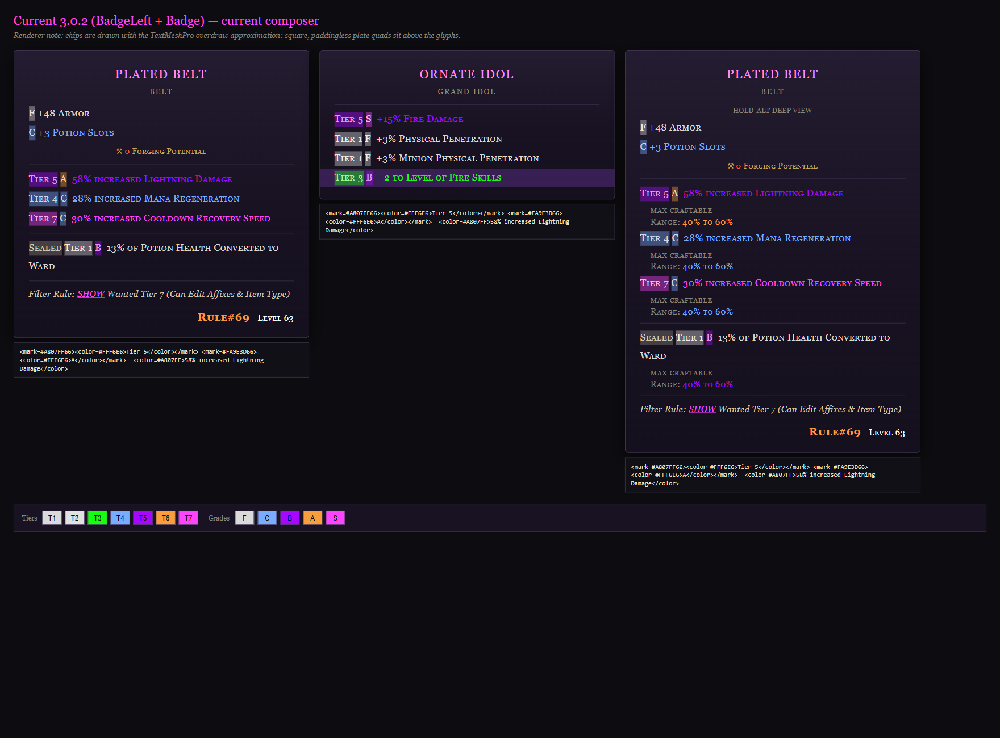
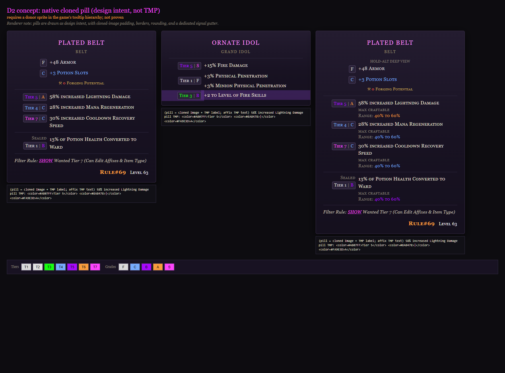
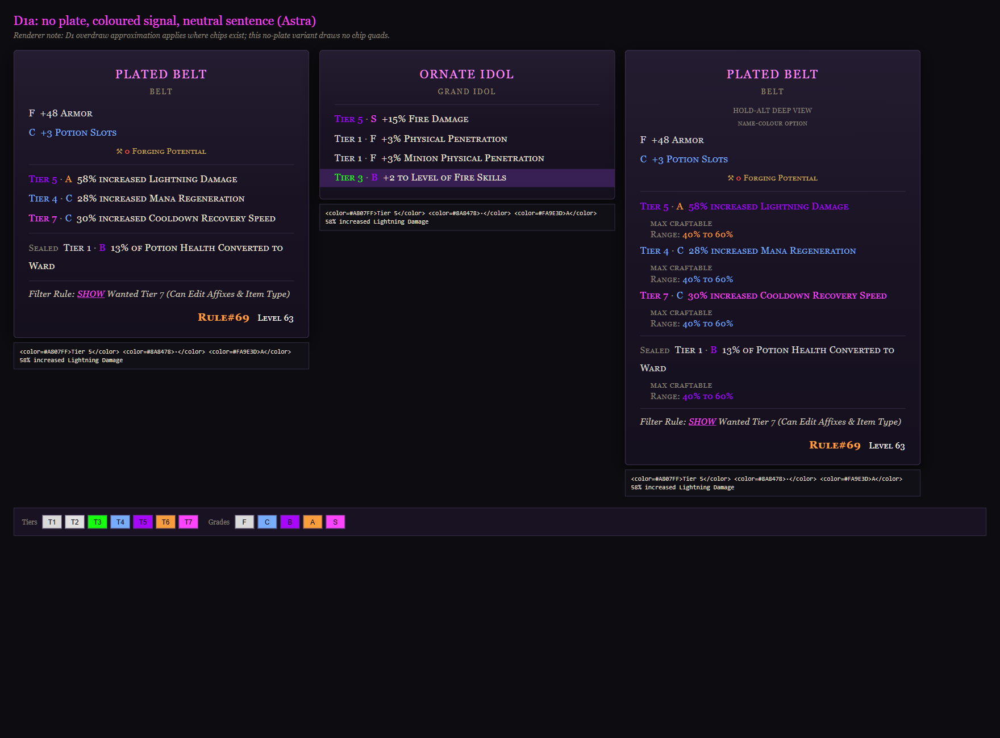
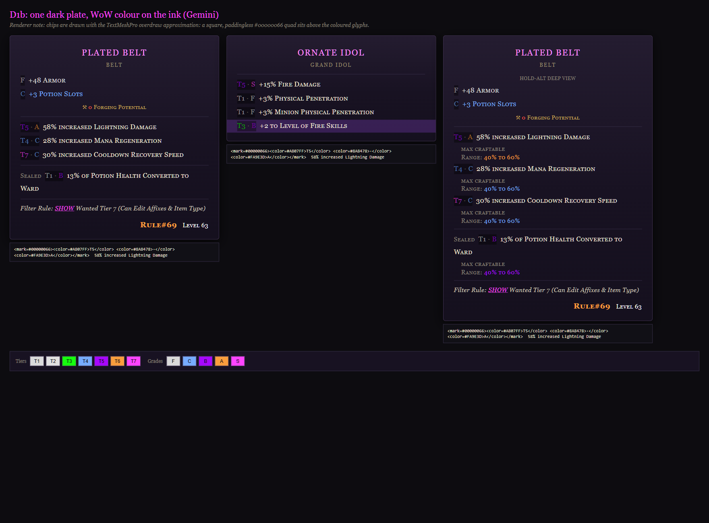
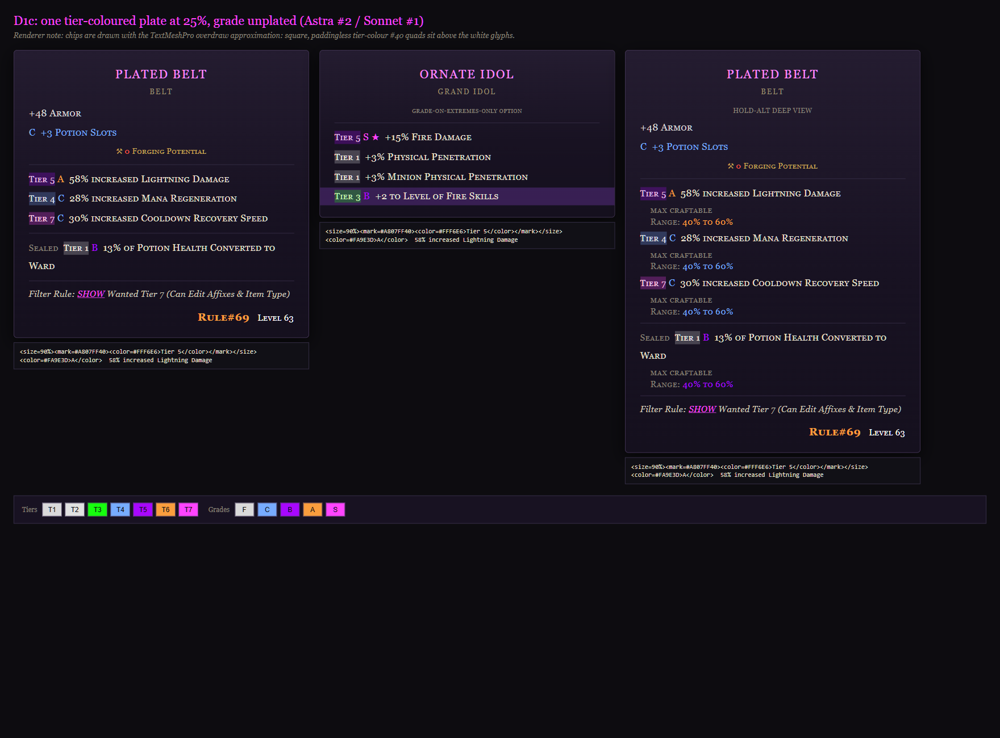
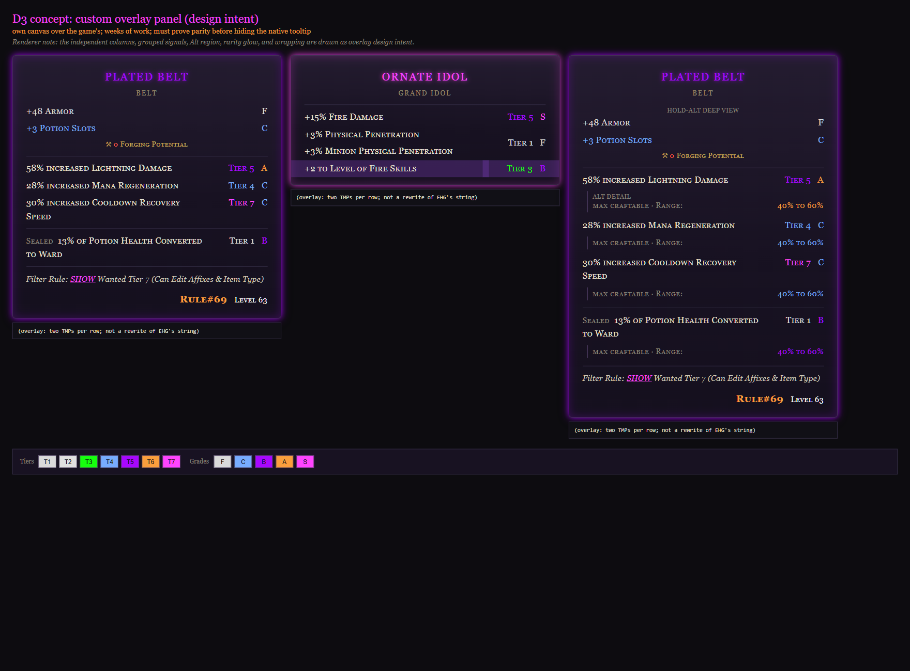

# Terrible Tooltips — DESIGN DECK (2026-09-11, v3 08:46; round three 08:47)

## STATUS: RULED. Andrew approved a direction at 08:41 (on the v1 deck, via the team lead; verbatim in `RULINGS-andrew.md`)
- **Target look = D2 native-cloned pill** (`Tier N | G` as a real UI pill on the palette, sentence beside it). Feasibility NOT PROVEN, so the next build is a BOUNDED D2 PROBE (one cloned donor pill on one affix line, in-game, fail-loud, staged only, Codex builds, Gemini reviews).
- **GREATER-AFFIX TINT (final 08:42):** T1–T5 affix sentences plain white; T6 and T7 sentences share ONE light purple `#C990FF` (deliberately NOT a palette colour) so "these are your greater affixes" reads calmly. Pill ink stays on the palette exactly (Tier 6 `#FA9E3D`, Tier 7 `#FF44FF`, grades F/C/B/A/S as today). Never bold, no plate, no glow.
- **Fallback if the probe fails = D1** (one signal unit per line, same colours, same tint rule). The rest of this deck is the seven-seat council record that informs the probe and the fallback. The council's round two, which ran after the ruling, matters for the fallback's shape (below).
- **Round three (08:47, after the ruling):** asked the four Cursor seats "given the tint, is the pill still needed on T1–T5?" 3–1 for RESERVING the pill to T6/T7 with a small coloured `Tier N · G` text mark on T1–T5 (Composer, Kimi, GLM) vs uniform pills (Cursor-Grok: "a pill everywhere first; dual-mode is a follow-up"). All four name the same settling test (one mixed-tier item both ways, SDR + HDR, half-second triage), so TICKET-D2-PROBE carries a `PillTiers` switch (All / GreaterOnly) instead of picking. All four say #C990FF reads apart from the T5 ink; GLM and Cursor-Grok flag #C990FF next to the T7 ink #FF44FF as the risky pair for deutan/protan viewers, rescued by the "Tier 7" number in the pill. Verbatim: `signed\ROUND3-pill-on-low-tiers.md`. Extra render of the tint rule: `renders\design-2026-09-11-D2-t6t7-rule-1x.png` (mockup `mockups\design-2026-09-11-D2-t6t7-rule.html`).
- **Still open (Andrew, one line each):** pill on ALL lines or only T6/T7 (`PillTiers`; the probe ships with All, flip it in the cfg) · "Tier 5" spelled out or "T5" · S ★ decoration (F always keeps its letter) · filter rule number 200% → 120% bold gold · two-stat grouping (only possible if the probe proves a per-affix container) · D3 stays parked unless he says otherwise.

Andrew's words that framed the whole thing: "clear but colorful … not overwhelmed … keep the WoW palette … different but familiar." Nothing under src\ changed. Nothing built, deployed, committed or pushed. PNGs in `docs\design-2026-09-11\renders\`, HTML in `mockups\design-2026-09-11-*.html`; every mockup shows the same three panels: the Plated Belt, a four-affix idol with a two-stat affix and a weaver line, and the belt under Hold-Alt.

## Who sat (Andrew's 07:44 order: "cursor pockets are deep")
🔵 Astra lead deep dive · 🟢 Gemini what's-on-screen · 🟠 Sonnet player-familiarity (my lineage, discounted) · 🟣➤⚫ Cursor-Grok adversarial ♾️ · 🟣➤🎼 Composer fresh-eyes ♾️ · 🟣➤🌙 Kimi typography 💸 · 🟣➤🔷 GLM colour-blind safety 💸. All blind in round one; the four Cursor seats then read the synthesis and the renders and voted. Mockups built by 🔵 Codex, read against the ticket by 🟢 Gemini (6/6 match) and 🟣➤🌙 Kimi (6/6, one note), colour-audited by 🟣➤🔷 GLM, rendered and judged by a 🟠 Sonnet Playwright seat, read as a player by 🟣➤🎼 Composer. ⚫ native Grok benched. Full argument and spend table: `SYNTHESIS.md`; every seat verbatim in `signed\`. On-demand is disabled on the Cursor account, so no overage.

## The current look, honestly (3.0.2, "BadgeLeft + Badge")

`Tier 5` plate, `A` plate, sentence in the tier colour: two `<mark>` quads per line, eight on a 4-affix idol, three on a sealed line, on top of EHG's purple weaver bar. Seven seats, blind, said the same thing in their own words: the palette is fine, the two plates are the overload. From the code: TMP's `<mark>` draws its quad OVER the glyphs with no padding and square corners, so a chip can never look like a CSS badge. The HDR white block is real; its cause is not established.

## D2 — the approved target: native-clone pill (probe first)

A real UI pill per affix, sprite behind its own label: the only way to get a plate UNDER the glyphs. Composer's player read: fastest scan of the six. Kimi: "the correct permanent home for chips because it kills the overdraw law". Proven: NativeClone in Terrible Inventory clones buttons and rows into panels. Not proven: any donor pill in the tooltip hierarchy, its attachment point, survival of UpdateLayout re-measure and pooled-TMP reuse, the gutter that aligns the sentences. **What the probe must answer (Astra):** which donor (six candidates: the container around `ItemTooltipAffix._tierText`, the range widget, the weaver decoration, LP/Weaver's-Will labels, the Sort button, settings artwork) · gutter via TMP margin before the remeasure · pill placed from rendered text geometry, not line-index arithmetic · no raycast, no navigation, no donor scripts or localisation · ownership by tooltip + TMP + generation + source line · exit criteria: no stale pill on item swap, no intercepted click, no per-frame instantiation, full restore on master-off, comparison tooltips owned separately. Twelve failure modes in `signed\SIGNED-codex-astra.md`. Multi-stat grouping under one pill (as the mockup draws it) only if the probe proves a per-affix container.

Greater-affix tint note for the probe: `#C990FF` is a sentence colour, so it lives in the existing `<color>` path regardless of whether the pill works; GLM's contrast concern was about `#A807FF` on the dark ground, and a lavender is far lighter, so the tint improves the worst-contrast case the council found.

## D1 — the fallback, and the council's own answer

`Tier 5 · A  58% increased Lightning Damage`, one coloured-text unit per line, no plate. Every seat that voted after seeing the renders chose this shape, two reversing their own blind chip proposals, because a browser cannot show TMP overdraw and the no-plate unit is the only shape with no attack on record: it cannot wash out under HDR, adds no second quad on the weaver bar, is lightest on GLM's colour audit, and Kimi found it is exactly what the shipped composer emits in `PlainText`. **Council note on the ruling's fallback wording** ("D1 shaped to approximate the pill, D1b or D1c"): the round-two votes say the plated D1 shapes carry real attacks (below) and recommend the fallback be the no-plate unit with the approved tint rule applied to the sentence. Andrew's call.

**D1b — one DARK plate, WoW colour on the ink**

Attacks: the dark quad muddies T1/F grey ink and stacks a second dark layer on the weaver bar (GLM audit); "dark plates mute tier joy" (Composer). Two seats would still pick it IF a plate is forced (Cursor-Grok, Gemini) because a black quad cannot wash to white.

**D1c — one TIER-coloured plate at 25%, grade unplated**

The render seat's and Composer's favourite on screen. Attacks: same primitive that washed to a white block under HDR, at a weaker alpha (Cursor-Grok); the idol panel carries Sonnet's "hide F" option, the one colour-blind failure in all six mockups (GLM). Three seats would pick it IF a plate is forced (Composer, Kimi, GLM). Only an in-game alpha strip can decide between D1b and D1c.

## D3 — custom overlay (parked)

Own panel over the game's: two columns, grouped multi-stat, rarity glow on the name. Lowest colour load of all six and Composer's worst three-second read ("you read the stat left, then hunt right"). Weeks of work; must prove parity while the native tooltip stays visible; controller mode, canvas order, two tooltips at once, LeHud, Fallen, every game patch. Gemini says it "violates" the treaties; Astra and Cursor-Grok say it must preserve them and can.

## What LE's UI cannot do for a text-rewrite mod (Andrew's "maybe it's a UI limitation")
No plate under glyphs, ever (the reason D2 is the target) · no rounded corners, padding, shadows · no real two-column layout (`<pos>` moves a caret) · no hanging indent (a wrapped line restarts under the unit and reads as a new affix) · no guaranteed one line per affix · nothing clickable · no reliable multi-stat grouping from strings (equal grades on two lines are the SAME roll) · no control over the weaver bar · `<sprite>` and ★ only if the game font has the glyph · no controller parity from keyboard Alt. What EHG would have to reimagine: first-class tier/roll fields on the row, stable multi-stat grouping, responsive columns, progressive detail, controller parity. Astra's full table: `signed\SIGNED-codex-astra.md`.

## Council tally on the queue (for the record; Q1–Q2 are now ruled)
| Q | Council | Andrew |
|---|---|---|
| 1 plate or not | no plate 5–2 | **D2 real pill; D1 fallback** |
| 2 sentence colour | tier colour 3, neutral 3, value-only 1 | **white T1–T5, `#C990FF` T6–T7** |
| 3 dark vs tier plate (if any) | dark 2, tier 3 | moot under D2; alpha strip if D1 needs a plate |
| 4 "Tier 5" vs "T5" | spelled 4, compact 3 | open |
| 5 grade letter colour | grade colour 6, neutral 1 | grade colours on the palette (ruled with the pill) |
| 6 S ★ | no 3, yes 2 | open; F always keeps its letter |
| 7 filter rule size | 120% bold gold, unanimous | open |
| 8 next build | D1 only, unanimous | **D2 PROBE, staged; D1 fallback**; D3 parked |

## NEXT-STEP: TICKET-D2-PROBE — BUILT AND STAGED 09:15 (docsuild-2026-09-11\; Codex build, Gemini APPROVE_WITH_NOTES, 0 repair rounds; NOT deployed; Andrew's steps in PROBE-README.md). The outline below is what was built:
1. Hierarchy dump around the affix TMPs of an open tooltip (DebugLog path): every ancestor/sibling with an Image, its sprite name, border/slicing, size; log once per session.
2. Pick ONE donor from the dump (Astra's candidate table); clone it via the NativeClone pattern (strip scripts, localisation, persistent listeners, raycast, navigation, animators).
3. Attach to ONE known affix TMP's row; reserve a left gutter via the TMP margin before RequestRelayout; place from rendered text geometry after layout; label TMP inside the pill carries `<color=tier>Tier N</color> <color=dim>|</color> <color=grade>G</color>`.
4. Sentence colour rule (independent of the pill, lands even if the probe fails): T1–T5 `#FFFFFF`-family plain, T6–T7 `#C990FF`; `NameColorMode` gains the ruled mode as default; old values keep working.
5. Fail-loud: if the donor is missing or the pill misplaces, log once and degrade to the D1 text unit for that line; never a stale or duplicate pill.
6. Exit criteria (Astra): long wrapped stat, Alt, two-stat idol, rapid item swaps, stash compare, master-off restore, LeHud + Fallen loaded, 1080p at 100/125/150% UI scale, SDR and HDR capture.
7. Staged only; Gemini cross-vendor review; deploy waits for Andrew.

## Open items
- The "2x" renders are same-scale duplicates (headless DPR was 1).
- Every colour/alpha judgement is from a browser approximation; the game is the gate.
- ★ and 🔒 glyph availability in the game font: unverified.
- GLM's council session read the HTML, not the PNGs (wrong folder); its audit and votes are from markup.
- `#C990FF` is a new colour outside the frozen brand set by Andrew's explicit ruling; Colors.cs and the README legend need the addition when the probe ships.
- Seats not present: native Grok (benched).
